# Step 0: Agent Engine インスタンスの作成と設定

## 📋 このステップでやること

```mermaid
flowchart LR
    A["1. Client 初期化"] --> B["2. Agent Engine\nインスタンス作成"]
    B --> C["3. Embedding モデルを\nmultilingual に変更"]
```



---

## 💡 Insight 1: Agent Engine = AI エージェントの本番運用プラットフォーム

**Vertex AI Agent Engine** は「Memory Bank の入れ物」ではなく、AI エージェントをデプロイ・管理・スケールするための**サービス群**。Memory Bank はその中の一機能にすぎない。

| サービス | 説明 |
|---------|------|
| **Runtime** | エージェントのデプロイとスケール |
| **Sessions** | ユーザーとエージェント間のやりとりを保存 |
| **Memory Bank** | セッション / 会話から情報を保存・取得して対話をパーソナライズ |
| **Code Execution** (Preview) | セキュアなサンドボックスでコード実行 |
| **Example Store** (Preview) | Few-shot examples の保存と動的取得 |

エージェントをデプロイしなくても Memory Bank **単体** で使える。
1つのインスタンスで複数ユーザー・複数スコープのメモリを管理できる。

```
Agent Engine インスタンス（サービス群のアクセスポイント）
├── [Sessions] セッション管理
├── [Memory Bank] メモリ管理
│   ├── user-1 のメモリ群
│   ├── user-2 のメモリ群
│   └── ...
├── [Code Execution] コード実行サンドボックス
└── [Example Store] Few-shot examples
```

---

## 💡 Insight 2: Embedding モデルの選び方

Memory Bank は内部でテキストの **ベクトル表現 (embedding)** を使って類似検索を行う。

| タイミング | 何をベクトル化？ |
|-----------|---------------|
| **メモリ作成時** | 保存する fact のテキスト |
| **検索時** | `search_query` のテキスト |

両方が**同じモデル**でベクトル化されないと、正しい類似度が計算できない。

### デフォルトモデルの問題

デフォルトは `text-embedding-005`（英語最適化）。日本語では意味的な検索精度が落ちる。

```
クエリ: 「どんな開発をしていますか？」
期待: 「コーチングエージェントを開発中」 ← これがヒットしてほしい
実際: 「趣味は絵を描くこと」           ← 違うメモリがヒット 😢
```

### 解決策: multilingual モデルに変更

```python
EMBEDDING_MODEL = (
    f"projects/{PROJECT_ID}/locations/{LOCATION}"
    f"/publishers/google/models/text-multilingual-embedding-002"
)
```

> **⚠️ 注意**: モデル名は短縮名（`text-multilingual-embedding-002`）ではなく、
> フルリソースパス形式で指定する必要がある。

---

## 💡 Insight 3: update() の config 構造

Agent Engine の設定変更は `update()` で行う。Memory Bank 関連の設定は `config.context_spec.memory_bank_config` に入る。

```python
client.agent_engines.update(
    name=AGENT_ENGINE_NAME,
    config={
        "context_spec": {                          # ← AgentEngineConfig のフィールド
            "memory_bank_config": {                # ← ReasoningEngineContextSpec の中
                "similarity_search_config": {
                    "embedding_model": "projects/..."
                }
            }
        }
    },
)
```

設定できる項目は他にもある:

| config パス | 説明 |
|------------|------|
| `memory_bank_config.similarity_search_config` | embedding モデル |
| `memory_bank_config.generation_config` | メモリ生成に使う LLM モデル |
| `memory_bank_config.customization_configs` | カスタムトピック・生成例 |
| `memory_bank_config.ttl_config` | メモリの有効期限（TTL） |
| `memory_bank_config.disable_memory_revisions` | リビジョン記録の無効化 |

---

## ✅ 確認ポイント

- [ ] Agent Engine インスタンスが作成されたか
- [ ] `.env` に `AGENT_ENGINE_NAME` を追記したか
- [ ] embedding モデルが `text-multilingual-embedding-002` に設定されたか
