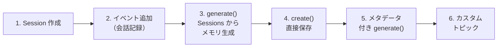

# Step 1: メモリの作成（Sessions 連携 & create）

## 📋 このステップでやること



---

## 💡 Insight 1: Sessions 連携 — メモリ生成の本来のフロー

Memory Bank の本来の使い方は **Sessions API と連携** すること。
会話を Sessions に記録し、そこからメモリを自動生成する。

```python
# 1. セッション作成（user_id でスコープが自動設定される）
session = client.agent_engines.sessions.create(
    name=AGENT_ENGINE_NAME,
    user_id="user-1",
)

# 2. イベント追加（会話を記録）
client.agent_engines.sessions.events.append(
    name=session.response.name,
    author="user",
    invocation_id="1",
    timestamp=datetime.datetime.now(tz=datetime.timezone.utc),
    config={"content": {"role": "user", "parts": [{"text": "こんにちは！"}]}}
)

# 3. Sessions からメモリ生成
client.agent_engines.memories.generate(
    name=AGENT_ENGINE_NAME,
    vertex_session_source={"session": session.response.name},
    # scope は省略可能（session.user_id から自動設定）
)
```

### データソースの比較

| | `vertex_session_source` | `direct_contents_source` |
|---|---|---|
| **データの渡し方** | Session の名前を渡すだけ | API コールに会話を直接埋め込む |
| **scope** | 省略可（session.user_id から自動） | 必須 |
| **時間範囲指定** | `start_time` / `end_time` で可能 | 不可 |
| **主な用途** | 本番エージェント | テスト・外部システム連携 |

---

## 💡 Insight 2: メモリ作成の2つの方法

| メソッド | 動作 | ユースケース |
|---------|------|------------|
| **`generate()`** | 会話データを LLM に読ませてファクトを**自動抽出・統合** | セッション終了後にまとめて記憶 |
| **`create()`** | 指定したファクトを**そのまま保存** | 管理者が既知の情報を直接登録 |

### generate() の特徴

- 会話に **Memory Topics に該当する意味ある情報** がなければ何も生成しない（`response=None`）
- 既存メモリと重複・矛盾があれば **Consolidation**（統合）が走る
- 戻り値の `action` で何が起きたか分かる: `CREATED` / `UPDATED` / `DELETED`

### create() の特徴

- LLM は介在しない。指定した `fact` がそのまま保存される
- Consolidation は**走らない** → 重複管理は自分で行う
- 戻り値は `AgentEngineMemoryOperation`（LRO）。デフォルトで完了まで待つ

---

## 💡 Insight 3: `generate()` は重複を防ぐ — Consolidation

`generate()` は内部で **Extraction（抽出）→ Consolidation（統合）** の2フェーズが走る。
Consolidation で既存メモリと比較し、CREATE / UPDATE / DELETE を自動判断するため、
同じ情報を何回 `generate()` しても **メモリが無限に増えることはない**。

> 💡 Consolidation 時のメタデータ制御には `metadata_merge_strategy` が使える
> （`MERGE` / `OVERWRITE` / `REQUIRE_EXACT_MATCH` の3種類）。

---

## 💡 Insight 4: `scope` — メモリの「誰の・どの文脈の記憶か」を決める完全一致キー

**scope はメモリの所有者とコンテキストを一意に決めるキー。** フリーフォーマットの辞書で自由に設計できる。

```python
# 1️⃣ 最もシンプル: ユーザーごとの記憶
scope = {"user_id": "user-123"}

# 2️⃣ サービス別: 同じユーザーでもサービスごとに記憶を分離
scope = {"service": "art-coaching", "user_id": "user-123"}

# 3️⃣ プロジェクト粒度: 案件ごとに記憶を分ける
scope = {"user_id": "user-123", "project_id": "project-abc"}
```

### scope の重要な特性

| 特性 | 説明 |
|------|------|
| **完全一致** | `retrieve()` は scope が**すべてのキー・値で完全一致**するメモリだけ返す |
| **統合範囲** | Consolidation も同じ scope 内でのみ発生。異なる scope 間では統合されない |
| **不変** | 作成後に scope は変更できない |
| **順序不問** | `{"a": "1", "b": "2"}` と `{"b": "2", "a": "1"}` は同じ |
| **Sessions 連携** | `vertex_session_source` 使用時、scope 省略で `{"user_id": session.user_id}` が自動設定 |

> ⚠️ **部分一致はできない。** `{"service": "art-coaching"}` で取得しても、`{"service": "art-coaching", "user_id": "user-123"}` のメモリはヒットしない。

---

## 💡 Insight 5: メモリトピック — 「何を覚えるか」の抽出ガイドライン

Topics は LLM に「どんな情報を記憶する価値があるか」を教える **抽出フィルター**。
Topics に該当しない情報はそもそも抽出されない。**最終的にメモリに保存されるのは fact（テキスト）だけ**。

```
会話: "Pythonが好きで、猫を2匹飼っていて、今日は天気がいいですね"

topics = [USER_PREFERENCES] の場合:
  → fact: "Pythonが好き"         ← 抽出される
  → fact: "猫を2匹飼っている"    ← 抽出される
  → "天気がいい"                 ← 抽出されない（トピックに該当しない）
```

### デフォルトのマネージドトピック（4つ）

| トピック | 説明 | 例 |
|---------|------|-----|
| `USER_PERSONAL_INFO` | 個人情報 | 「Google で働いています」 |
| `USER_PREFERENCES` | 好み・嫌い | 「真ん中の席がいいです」 |
| `KEY_CONVERSATION_DETAILS` | 会話の重要な結果 | 「航空券を予約しました」 |
| `EXPLICIT_INSTRUCTIONS` | 明示的な記憶指示 | 「Python を使っていることを覚えておいて」 |

### カスタムトピック

独自の抽出カテゴリを定義できる。`label` と `description` で LLM に何を抽出すべきか指示する。
マネージドトピックと組み合わせる場合は、**両方を明示的に指定する**（カスタムだけ設定するとマネージドが消える）。

---

## 💡 Insight 6: メタデータ — メモリにタグを付けてフィルタリング

`generate()` / `create()` / `update()` の `config` にメタデータを渡すと、メモリにタグを付与できる。
（`update()` はメタデータ専用。fact の直接書き換えはできない。）

### 対応する型

| 型 | キー | 例 |
|---|------|-----|
| 文字列 | `string_value` | `{"category": {"string_value": "learning"}}` |
| 数値 | `double_value` | `{"priority": {"double_value": 1.0}}` |
| ブール | `bool_value` | `{"reviewed": {"bool_value": True}}` |
| タイムスタンプ | `timestamp_value` | `{"time": {"timestamp_value": datetime(...)}}` |

> ⚠️ **メタデータフィルタは「完全一致」のみ。** 大小比較・範囲指定はできない。
> 時間の範囲フィルタが必要なら、システムフィールド（`create_time` / `update_time`）を使う。

メタデータは `retrieve()` 時の[フィルタリング](https://docs.cloud.google.com/agent-builder/agent-engine/memory-bank/fetch-memories?hl=ja#metadata-filter)にも使える（詳細は Step 2）。

---

## ✅ 確認ポイント

- [ ] Sessions を使ってセッション作成 → イベント追加 → メモリ生成ができたか
- [ ] `generate()` で会話から複数のファクトが自動抽出されたか
- [ ] `create()` で指定したファクトがそのまま保存されたか
- [ ] メタデータ付き `generate()` でメモリに metadata が付与されたか
- [ ] カスタムトピック設定後に技術情報が正しく抽出されたか
