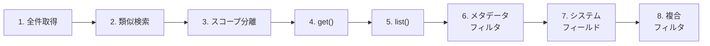

# Step 2: メモリの取得（Retrieve）— 深掘り

## 📋 このステップでやること



1. **全件取得** — scope 内の全メモリを取得
2. **類似検索** — クエリに意味的に近いメモリだけ取得（distance 付き）
3. **スコープ分離** — 別 user_id ではメモリが見えないことを確認
4. **単一メモリ取得** — `get()` で 1 件取得し全フィールドを確認
5. **メモリ一覧** — `list()` で Agent Engine 内の全メモリを確認
6. **メタデータフィルタ** — `filter_groups`（DNF）で絞り込み
7. **システムフィールドフィルタ** — `filter`（EBNF）で topics / create_time / fact をフィルタ
8. **複合フィルタ** — メタデータ + システムフィールドの同時利用

---

## 💡 Insight 1: `retrieve()` の2つのモード

`retrieve()` は `similarity_search_params` の有無で動作が変わる：

| モード | パラメータ | 動作 |
|-------|----------|------|
| **全件取得** | `similarity_search_params` なし | そのスコープの全メモリを返す |
| **類似検索** | `similarity_search_params` あり | クエリに近い上位 N 件だけ返す |

```python
# 全件取得
client.agent_engines.memories.retrieve(
    name=AGENT_ENGINE_NAME,
    scope={"user_id": "user-1"},
)

# 類似検索（top_k でヒット数を制御）
client.agent_engines.memories.retrieve(
    name=AGENT_ENGINE_NAME,
    scope={"user_id": "user-1"},
    similarity_search_params={
        "search_query": "趣味は何？",
        "top_k": 3,  # デフォルト値も 3
    },
)
```

---

## 💡 Insight 2: 類似検索は「キーワード一致」ではない

内部でエンべディングモデルによるベクトル検索が行われるため、**意味的に近い** メモリがヒットする。

例えば：
- クエリ「どんな仕事？」→ 「コーチングエージェントを開発」がヒット（「仕事」という単語がなくてもマッチ）
- クエリ「趣味は何？」→ 「絵を描くことと猫と遊ぶこと」がヒット

類似検索の結果には `distance`（ユークリッド距離）が付与される。値が小さいほど類似度が高い。

---

## 💡 Insight 3: 本番では類似検索を使う

全件取得は便利だが、メモリが増えると **全件をプロンプトに入れるとトークンが爆発** する。

```python
# ユーザーの発言をクエリにして、関連メモリだけ取得
user_message = "今日は絵の練習をしました"
memories = client.agent_engines.memories.retrieve(
    name=AGENT_ENGINE_NAME,
    scope={"user_id": user_id},
    similarity_search_params={
        "search_query": user_message,
        "top_k": 5,
    },
)
```

---

## 💡 Insight 4: scope は完全一致

`retrieve(scope={"user_id": "user-1"})` は `user-1` のメモリ **だけ** を返す。これにより **マルチテナント・マルチユーザーのデータ分離** が scope だけで実現できる。

---

## 💡 Insight 5: `get()` と `list()` — スコープ不要の取得方法

`retrieve()` 以外にも2つの取得方法がある：

| メソッド | 用途 | scope 必要? | 戻り値 |
|---------|------|------------|--------|
| `get(name=...)` | 1件取得（メモリ名指定） | 不要 | `Memory` オブジェクト |
| `list(name=...)` | 全メモリ一覧 | 不要 | ページネーション対応イテレータ |
| `retrieve(scope=...)` | スコープ内取得 + 類似検索 | **必要** | `RetrievedMemory` のイテレータ |

```python
# 単一メモリ取得（全フィールドが返る）
memory = client.agent_engines.memories.get(name="projects/.../memories/...")
# → fact, scope, metadata, topics, create_time, update_time

# 全メモリ一覧（Agent Engine 内すべて）
pager = client.agent_engines.memories.list(name=AGENT_ENGINE_NAME)
for m in pager:
    print(m.fact)
```

> ⚠️ `list()` はスコープに関係なく **全ユーザーのメモリ** が返る。管理・デバッグ用途向け。

---

## 💡 Insight 6: メタデータフィルタ（`filter_groups`）

`retrieve()` の `config.filter_groups` でメタデータベースの絞り込みができる。

### DNF（論理和標準形）

フィルタは **DNF 形式**（AND の OR）で指定する：

```python
# (category=learning AND priority=high) OR (category=work)
config={
    "filter_groups": [
        {  # グループ1: AND で結合
            "filters": [
                {"key": "category", "value": {"string_value": "learning"}},
                {"key": "priority", "value": {"string_value": "high"}},
            ]
        },
        {  # グループ2: グループ1 と OR で結合
            "filters": [
                {"key": "category", "value": {"string_value": "work"}},
            ]
        },
    ]
}
```

### メタデータの型

| 型 | 指定例 |
|----|-------|
| 文字列 | `{"string_value": "learning"}` |
| 数値 | `{"double_value": 1.23}` |
| 真偽値 | `{"bool_value": True}` |
| タイムスタンプ | `{"timestamp_value": datetime(...)}` |

> ⚠️ メタデータフィルタは **完全一致のみ**。部分一致や大小比較はできない。

---

## 💡 Insight 7: システムフィールドフィルタ（`filter`）

`config.filter` で EBNF 構文の文字列を指定してフィルタできる。メタデータフィルタでは不可能な **部分一致・範囲指定・トピック** が使える。

### 使えるフィールド

| フィールド | 演算子 | 例 |
|-----------|--------|-----|
| `fact` | `=~`（正規表現） | `fact=~".*Python.*"` |
| `create_time` | `>=`, `<=`, `>`, `<` | `create_time>="2026-01-01T00:00:00Z"` |
| `update_time` | `>=`, `<=`, `>`, `<` | `update_time<="2026-12-31T23:59:59Z"` |
| `topics.managed_memory_topic` | `:` (HAS) | `topics.managed_memory_topic: USER_PREFERENCES` |
| `topics.custom_memory_topic_label` | `:` (HAS) | `topics.custom_memory_topic_label: technical_skills` |

### 組み合わせ

```python
# fact に "Python" を含み、かつ今月以降に作成されたメモリ
config={
    "filter": 'fact=~".*Python.*" AND create_time>="2026-02-01T00:00:00Z"'
}

# マネージドトピック OR カスタムトピック
config={
    "filter": (
        "topics.managed_memory_topic: USER_PREFERENCES "
        "OR topics.custom_memory_topic_label: technical_skills"
    )
}
```

---

## 💡 Insight 8: フィルタの組み合わせ

`filter_groups`（メタデータ）と `filter`（システムフィールド）は **同じリクエストで同時に使える**。両方の条件を満たすメモリだけが返る。

```python
# category=learning のメタデータを持ち、かつ fact に TypeScript を含む
results = client.agent_engines.memories.retrieve(
    name=AGENT_ENGINE_NAME,
    scope=SCOPE,
    config={
        "filter_groups": [{
            "filters": [
                {"key": "category", "value": {"string_value": "learning"}}
            ]
        }],
        "filter": 'fact=~".*TypeScript.*"',
    },
)
```

これにより：
- **メタデータ** → ユーザーが構造化タグとして付与した情報でフィルタ
- **システムフィールド** → 時間範囲、トピック、fact テキストでフィルタ
- **類似検索** → 意味的に近いものを絞る

を自由に組み合わせて、必要なメモリだけを効率的に取得できる。

---

## ✅ 確認ポイント

- [ ] 全件取得で Step 1 で生成したメモリが取得できたか
- [ ] 類似検索で distance（ユークリッド距離）が表示されたか
- [ ] `get()` で全フィールド（fact, scope, metadata, topics, create_time, update_time）が表示されたか
- [ ] `list()` で Agent Engine 内の全メモリが一覧表示されたか
- [ ] メタデータフィルタで `category=learning` のメモリだけがヒットしたか
- [ ] 存在しないメタデータ値では0件になったか
- [ ] トピックフィルタ（マネージド / カスタム）で正しく絞り込めたか
- [ ] 複合フィルタ（filter + filter_groups）が動作したか
