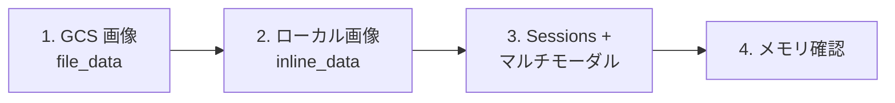

# Step 3: マルチモーダル入力からメモリを生成

## 📋 このステップでやること



---

## 💡 Insight 1: マルチモーダル入力の仕組み

Memory Bank は画像・動画・音声を受け取れるが、**保存されるのはテキスト（fact）のみ**。
LLM が画像を分析し、記憶すべき情報をテキストとして抽出する。

```
入力: 画像（犬の写真） + テキスト「これは私の犬のポチです」
  ↓ LLM が分析
出力: fact = "ユーザーはポチという名前の犬を飼っている"
```

> ⚠️ 画像自体はメモリに保存されない。あくまで「画像から読み取れた情報」がテキストとして記憶される。

---

## 💡 Insight 2: 画像の渡し方 — file_data vs inline_data

| 方法 | 渡し方 | ユースケース |
|------|--------|------------|
| `file_data` | GCS URI を指定 | GCS にアップロード済みの画像 |
| `inline_data` | バイナリを直接埋め込む | ローカルファイル、API 経由の画像 |

```python
# file_data: GCS の画像を参照
{"file_data": {"file_uri": "gs://bucket/image.jpg", "mime_type": "image/jpeg"}}

# inline_data: バイナリを直接渡す
with open("local.jpg", "rb") as f:
    image_bytes = f.read()
{"inline_data": {"mime_type": "image/jpeg", "data": image_bytes}}
```

---

## 💡 Insight 3: コンテキストを添えると精度が上がる

画像だけ渡すと LLM は「何の画像か」しかわからない。
テキストで**ユーザーとの関係性**を添えると、より意味のあるメモリが生成される。

```python
# ❌ 画像だけ → 「スコーンの写真」程度の情報
parts = [{"file_data": {"file_uri": "gs://...", "mime_type": "image/jpeg"}}]

# ✅ テキスト + 画像 → 「ベーキングが趣味で、週末にスコーンを作った」
parts = [
    {"text": "これは私が週末に作ったスコーンです。ベーキングが趣味なんです。"},
    {"file_data": {"file_uri": "gs://...", "mime_type": "image/jpeg"}},
]
```

---

## 💡 Insight 4: 対応フォーマット

`generate()` のイベントの `parts` で使えるのは以下の3つ:

| パーツ | 説明 |
|--------|------|
| `text` | テキスト |
| `inline_data` | バイナリデータ（画像・音声・動画） |
| `file_data` | GCS URI 参照 |

> ⚠️ `function_call` / `function_response` はメモリ生成時に**無視される**。

---

## ✅ 確認ポイント

- [ ] GCS 画像（`file_data`）からメモリが生成されたか
- [ ] ローカル画像（`inline_data`）からメモリが生成されたか
- [ ] テキストを添えることで、より意味のあるメモリが抽出されたか
- [ ] Sessions 経由でもマルチモーダルイベントが処理されたか
