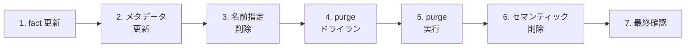
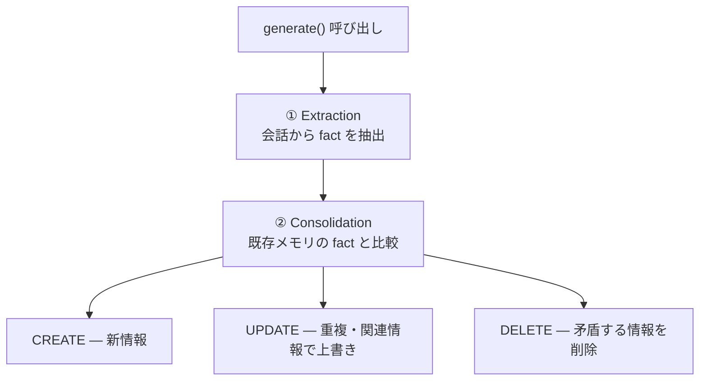

# Step 3: メモリの更新・削除

## 📋 このステップでやること



1. **fact の更新** — `update()` で fact テキストを変更
2. **メタデータの更新** — `update()` でメタデータを追加・変更
3. **名前指定の削除** — `delete()` で 1 件削除
4. **purge ドライラン** — `purge(force=False)` で削除件数を事前確認
5. **purge 実行** — `purge(force=True)` でフィルタに合致するメモリを一括削除
6. **セマンティック削除** — `generate()` で「忘れて」指示による LLM ベースの削除
7. **最終確認** — 残りのメモリを表示

---

## 💡 Insight 1: `update()` — fact とメタデータの直接更新

`update()` は既存メモリを直接変更する。`generate()` のような LLM 統合は行わない。

```python
# fact の更新
client.agent_engines.memories.update(
    name="projects/.../memories/...",
    fact="新しい fact テキスト",
)

# メタデータの追加・変更
client.agent_engines.memories.update(
    name="projects/.../memories/...",
    config={
        "metadata": {
            "category": {"string_value": "updated"},
            "score": {"double_value": 0.95},
        },
    },
)
```

**変更できるもの / できないもの：**

| フィールド | 変更可能? |
|-----------|----------|
| `fact` | ✅ |
| `metadata` | ✅ |
| `scope` | ❌（イミュータブル） |
| `name` | ❌（リソースID） |
| `create_time` | ❌（自動設定） |

> `update_time` は更新時に自動で変更される。

---

## 💡 Insight 2: `delete()` vs `purge()` — 単一削除と一括削除

| メソッド | 用途 | 対象指定 | 元に戻せる? |
|---------|------|---------|------------|
| `delete()` | 1件削除 | `name`（完全修飾名） | ❌ |
| `purge()` | 一括削除 | `filter` / `filter_groups` | ❌ |

```python
# 名前指定の削除
client.agent_engines.memories.delete(
    name="projects/.../memories/...",
    config={"wait_for_completion": True},
)

# フィルタ指定の一括削除（メタデータで絞り込み）
client.agent_engines.memories.purge(
    name=AGENT_ENGINE_NAME,
    filter_groups=[{
        "filters": [
            {"key": "category", "value": {"string_value": "temp"}}
        ]
    }],
    force=True,
    config={"wait_for_completion": True},
)

# スコープ指定の一括削除（特定ユーザーの全メモリ）
client.agent_engines.memories.purge(
    name=AGENT_ENGINE_NAME,
    filter='scope.user_id="123"',
    force=True,
)
```

---

## 💡 Insight 3: `purge()` のドライラン

`purge(force=False)` は **実際に削除せず、対象件数だけ返す**。本番環境で重要なセーフティネット。

```python
# まずドライランで確認
dry_op = client.agent_engines.memories.purge(
    name=AGENT_ENGINE_NAME,
    filter='scope.user_id="123"',
    force=False,  # ← ドライラン
    config={"wait_for_completion": True},
)
print(f"削除予定: {dry_op.response.purge_count} 件")

# 件数を確認してから実行
if dry_op.response.purge_count > 0:
    real_op = client.agent_engines.memories.purge(
        name=AGENT_ENGINE_NAME,
        filter='scope.user_id="123"',
        force=True,  # ← 実行
    )
```

> 💡 `purge()` では `filter`（システムフィールド）と `filter_groups`（メタデータ）の両方が使える。Step 2 のフィルタ構文がそのまま適用可能。

---

## 💡 Insight 4: セマンティック削除 — LLM による忘却

`generate()` に「忘れて」という自然言語の指示を渡すと、LLM が既存メモリの中から該当するものを判断して削除する。

```python
# 「食べ物の好みを忘れて」
client.agent_engines.memories.generate(
    name=AGENT_ENGINE_NAME,
    direct_contents_source={
        "events": [{
            "content": {
                "role": "user",
                "parts": [{"text": "食べ物の好みを忘れてください。"}],
            }
        }]
    },
    scope=SCOPE,
)
```

**注意点：**
- LLM の判断に依存するため **結果は非決定的**
- `EXPLICIT_INSTRUCTIONS` トピックが設定されている場合に機能する
- 「忘れて」だけでなく「〜は間違いです」のような矛盾情報でも削除されることがある
- 確実に削除したい場合は `delete()` や `purge()` を使うこと

---

## 💡 Insight 5: Consolidation（統合）の仕組み

`generate()` を呼ぶと、内部で2段階の処理が走る：



Consolidation は **fact（事実テキスト）の比較・統合** が本体。LLM が既存の fact と新しい fact を見比べて CREATE / UPDATE / DELETE を判断する。

---

## 💡 Insight 6: `metadata_merge_strategy` — 統合対象の制御

`metadata_merge_strategy` は Consolidation の **対象範囲とメタデータの扱い** を制御する。

| 戦略 | 統合対象 | メタデータの扱い | ユースケース |
|------|---------|----------------|------------|
| **MERGE**（デフォルト） | 同一スコープの全メモリ | 新旧をマージ（同キーは上書き） | 好み・設定など「最新だけ残ればいい」情報 |
| **OVERWRITE** | 同一スコープの全メモリ | 新メタデータで完全置換 | メタデータをリセットしたい場合 |
| **REQUIRE_EXACT_MATCH** | メタデータ完全一致のメモリのみ | そのまま維持 | 履歴として蓄積したい記録 |

### MERGE（デフォルト）— 最新の状態を保ちたい場合

- ユーザーの好み: 「コーヒーが好き」→「紅茶に変えた」→ 最新だけ残る
- プロフィール情報: 住所や勤務先が変わったら上書き

### OVERWRITE — メタデータをリセットしたい場合

- ステータス管理: メタデータを `{"status": "completed"}` に完全リセット
- バージョン管理: 古いメタデータキーを全て消して新しい版に差し替え

### REQUIRE_EXACT_MATCH — 履歴として蓄積したい場合

- 問い合わせ対応履歴: チケットごとに `ticket_id` が異なる → 統合されない
- 会議メモ: 日付ごとに `meeting_date` が異なる → 各回の議事録が残る
- 学習ログ: テストごとに `test_id` が異なる → 過去の成績が蓄積

---

## ✅ 確認ポイント

- [ ] `update()` で fact が変更できたか（`update_time` も変わるか）
- [ ] `update()` でメタデータが追加・変更できたか
- [ ] `delete()` で指定メモリが削除されたか（`get()` でエラーになるか）
- [ ] `purge(force=False)` でドライラン結果（対象件数）が返ったか
- [ ] `purge(force=True)` で実際に削除されたか
- [ ] セマンティック削除で `action=DELETE` が返ったか
- [ ] 最終確認で期待通りのメモリだけが残っているか
